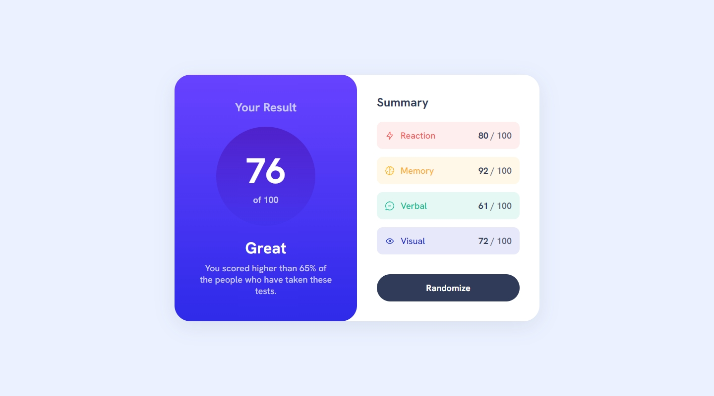
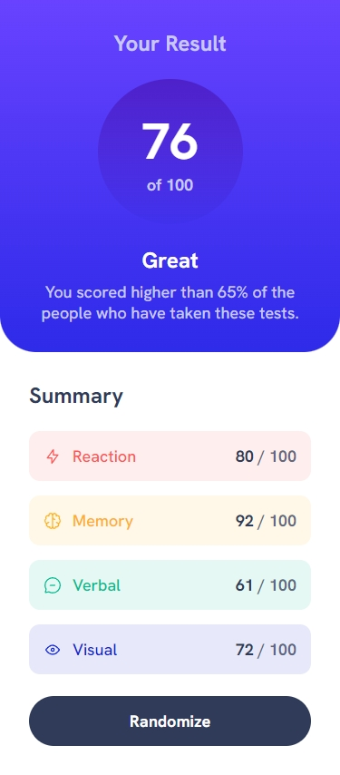

## Frontend Mentor Challenge 18 - Results Summary Component

This is my solution to the [Results Summary Component](https://www.frontendmentor.io/challenges/results-summary-component-CE_K6s0maV) challenge on [Frontend Mentor](https://www.frontendmentor.io/).

#

### Links. 🔗

- Live Site URL: https://results-summary-component-darkstarxdd.vercel.app/

#

### Screenshots of the Solution (Desktop & Mobile). 🔍

#

### Built with. 🔨

- React.
- Vanilla CSS.
- Vite.

#

### Features. ✨

- "Your Result" is calculated as the average of summary items ("Reaction", "Memory" etc.).
- The Grade ("Great", "Poor", "Average" etc.) is determined by "Your Result".
- On the initial render, results are fetched from the JSON file.
- Clicking the button randomizes each summary result, which updates "Your Result" and the Grade accordingly.

#

### New Things Learned. 🎓

- Mostly practicing things I learned in React recently, including passing data with props and using state.

#

### Testing and Accessibility. 🧪

- Tested site usability with keyboard-only navigation.
- Used the Responsively App to check the site's appearance on various screen sizes, from 320x480 to 3000x2000.
- Set the browser font size on desktop to various values ranging from 9px to 56px to ensure everything on the site scales properly with the user's preferred browser font size.
- Zoomed the page in and out using Ctrl + Scroll wheel (up to 500%).
- Tested with the NVDA screen reader.
- Viewed the site on an iPhone 11 in both portrait and landscape modes.
- Performed Lighthouse and PageSpeed tests. ([PageSpeed Result.](https://pagespeed.web.dev/analysis/https-results-summary-component-darkstarxdd-vercel-app/pl39zas4kr?form_factor=mobile))

#

### Tools I Use. 🔧

- [Prettier VS Code Extension](https://marketplace.visualstudio.com/items?itemName=esbenp.prettier-vscode) - Code formatter.

- [Responsively.app](https://responsively.app/) - A free and open source tool that allows you to test your webpage on different screen sizes, take screenshots and much more.

- [Color Contrast Checker by coolors.co](https://coolors.co/contrast-checker/112a46-acc8e5) - Check color contrast ratios and if needed, update the colors to match the WCAG guidelines.

- [Google Webfonts Helper by Mario Ranftl](https://gwfh.mranftl.com/fonts) - Provides WOFF2 format for Google Fonts.

- [PerfectPixel by WellDoneCode](https://chromewebstore.google.com/detail/perfectpixel-by-welldonec/dkaagdgjmgdmbnecmcefdhjekcoceebi) - A chrome extension that enables you to overlay an image, over a webpage. This makes it easier to spot any major differences between your result and the design.

#

- My Frontend Mentor Profile - [@DarkstarXDD](https://www.frontendmentor.io/profile/DarkstarXDD)
